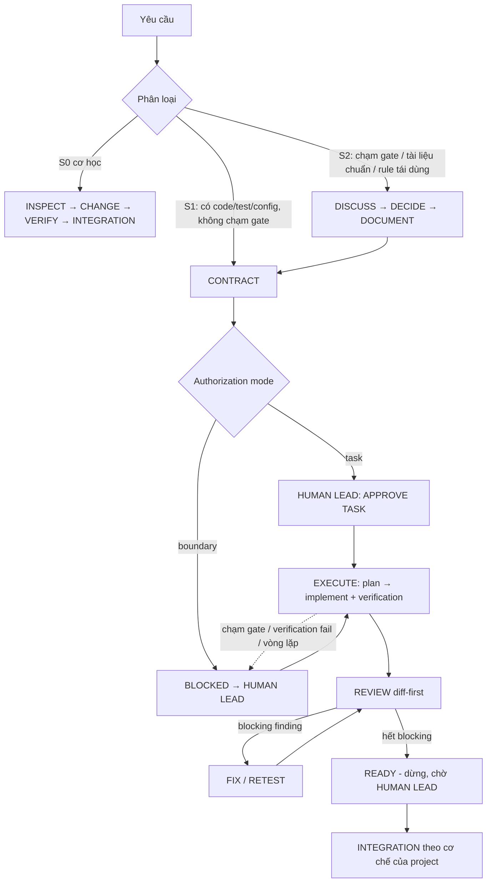

# Cơ chế của framework

Tài liệu giải thích **vì sao** và **chạy thế nào**. Không phải rule: mọi quy tắc chuẩn (normative) nằm ở canonical owner được trỏ tới bên dưới (`core/docs/ai/workflow.md`, `core/docs/ai/execution-profiles.md`, template Project Layer). Khi tài liệu này và owner khác nhau, owner thắng và tài liệu này cần sửa.

Ký hiệu: `workflow §x` = `core/docs/ai/workflow.md` mục x; `profiles` = `core/docs/ai/execution-profiles.md`. Trong project đã cài, hai file đó nằm ở `docs/ai/`.

## 1. Mục tiêu

Agent AI làm việc nhanh nhưng dễ trôi scope, tự quyết điều người chưa duyệt, hoặc dựa vào trí nhớ của cuộc chat. Framework đặt một ranh giới đơn giản: **người quyết boundary, agent tự thực thi bên trong boundary đã duyệt**; task approval là một governance mode chứ không phải luôn bắt buộc. (câu mở đầu `workflow`). Để làm được điều đó:

- **Repository là source of truth.** Quy tắc, task, quyết định và trạng thái nằm trong repository; session mới bootstrap từ repository, không từ transcript chat (`AGENTS.md` mục Bootstrap và Invariants).
- Phân loại công việc theo mức rủi ro để việc nhỏ đi nhanh, việc lớn qua người duyệt.
- Xác nhận bằng verification, không bằng lời cam đoan.

## 2. Ba lớp

| Lớp | Trả lời | Nằm ở | Ai sửa |
|---|---|---|---|
| **Framework Core** | làm việc thế nào | `core/docs/ai/workflow.md`, `execution-profiles.md` | không ai trong project; đổi qua kit (version mới) |
| **Project Layer** | project này là gì, đang ở đâu | `AGENTS.md`, `docs/ai/project-profile.md`, `docs/workflow/current-state.md`, `docs/tasks/`, `docs/ai/framework-history.md`, `FRAMEWORK_ADOPTION.md` | project |
| **Tool Adapter** | tool cụ thể hiện thực vai trò thế nào | `CLAUDE.md`, `.claude/**`, `.github/**` | project, theo tool |

Vì sao tách: Core dùng lại được giữa các project chỉ khi nó **không** chứa tên model / vendor hay chi tiết project (`profiles` mục "Adapter và vendor"). Tool đổi nhanh nên phần phụ thuộc tool bị nhốt ở adapter. Chi tiết project đổi theo thời gian nên ở Project Layer.

Nguyên tắc xuyên lớp: **một normative rule chỉ có một canonical owner**; nơi khác chỉ trỏ tới (`AGENTS.md` mục Invariants). Hai file mâu thuẫn là lỗi framework cần sửa, không phải trạng thái hợp lệ.

## 3. Authority, canonical owner, state

- **Authority order** là danh sách tài liệu nào thắng khi mâu thuẫn; mỗi project tự khai ở `docs/ai/project-profile.md` §2 (template `templates/docs/ai/project-profile.md`). `AGENTS.md` bắt agent tuân thứ tự đó.
- **current-state** (`docs/workflow/current-state.md`) là operational state: tiêu điểm hiện tại, blocker, việc tiếp theo. Metadata `Status` luôn là `OPERATIONAL STATE — NOT AUTHORITY`; chỉ ghi điều không suy ra được từ Git, task contract hoặc quyết định đã duyệt. Nó không authorize việc gì.
- **File lịch sử** (`framework-history.md`, task đã DONE) mô tả quá khứ, không phải authority hiện hành (`AGENTS.md` Invariants).
- Không mô tả thành phần mới chỉ được lên kế hoạch như đã implemented; module map phải phân biệt planned / implemented (template project-profile §3).

## 4. Vai trò và execution profile

Ba vai trò (`workflow §1`): HUMAN LEAD (quyết boundary, approve, commit/push/PR/merge), ORCHESTRATOR (thảo luận, viết task contract, điều phối, review diff-first), IMPLEMENTER (người viết chính, chạy verification, sửa finding). Vai trò được gán cho người / tool / model nào là việc của **execution profile**; mỗi task chọn một profile (`profiles`).

- `dual-agent`: một ORCHESTRATOR và một hoặc nhiều IMPLEMENTER instances; có review độc lập.
- `single-agent`: một agent đóng cả hai, nhưng vẫn bắt buộc pha review riêng (`profiles`; `workflow §7`).

Profile chỉ **thêm** ràng buộc, không nới workflow (`profiles`). Adapter quyết định profile được hiện thực thế nào với từng tool: ví dụ adapter Claude Code map ORCHESTRATOR = session chính, IMPLEMENTER = subagent (`adapters/claude-code/`); adapter Copilot chạy IMPLEMENTER cục bộ, đã pilot với gói Free (`adapters/copilot/README.md`); adapter Codex chưa kiểm chứng (`adapters/codex/README.md`). Project khai profile được phép ở `docs/ai/project-profile.md` §7.

**Nhiều IMPLEMENTER.** Core không nói tool nào làm IMPLEMENTER. Project có thể khai một **Danh sách IMPLEMENTER** (mỗi adapter: điểm mạnh, giới hạn, dùng khi, dự phòng) ở `templates/docs/ai/project-profile.md` §7, do HUMAN LEAD duyệt. ORCHESTRATOR chọn IMPLEMENTER cho từng task lúc lập task graph và ghi vào field `Implementer`. Trong `boundary` mode, không cần APPROVE TASK riêng; lựa chọn vẫn bị giới hạn bởi danh sách adapter được phép. Luật chọn / đổi / song song nằm ở template §7. Lợi ích: khi IMPLEMENTER và ORCHESTRATOR thuộc vendor khác nhau, review diff trở thành review chéo (lỗi hệ thống của một model ít bị bỏ sót bởi model kia), và việc nhỏ có thể đi qua tool rẻ hơn. Tên model / vendor chỉ xuất hiện ở adapter và project profile, không ở Core.

## 5. S-class, decision gate và luồng công việc

`workflow §2` phân loại bằng S0 / S1 / S2 (mức cao nhất thắng); `workflow §3` liệt kê decision gate, chạm gate thì cần HUMAN LEAD quyết trước. Sơ đồ tổng quát (hành vi chuẩn nằm ở workflow):

Lý do có S0: việc cơ học (typo, đồng bộ pointer) không nên tốn contract. Lý do có S2: quyết định lâu dài (kiến trúc, dependency, policy) cần người quyết và một tài liệu ghi lại trước khi code.

## 6. Task contract và lifecycle

Task S1/S2 có một file contract (`workflow §4`; mẫu `templates/docs/tasks/_template.md`): goal, scope in/out, acceptance criteria, required verification, execution profile. Lifecycle phụ thuộc governance mode: `task` = `DRAFT → APPROVED → IN_PROGRESS → READY`; `boundary` = `DRAFT → IN_PROGRESS → READY`. DONE suy ra từ Git (READY + đã integrate), nên không cần commit "đóng task" riêng.

`APPROVE TASK` chỉ là gate của `task` mode. Trong `boundary` mode, HUMAN LEAD cấp authorization một lần cho implementation boundary; task ghi `Authorization source` và không được vượt boundary. IMPLEMENTER chỉ bắt đầu khi có contract, base commit, `Implementation authorized: YES` và plan ngắn (`workflow §1`).

## 7. Verification, review, dừng

- Required verification phải chứng minh trực tiếp từng AC và tất cả PASS trước READY; không claim PASS cho lệnh chưa chạy (`workflow §7`, `AGENTS.md`).
- Review theo `contract → diff → AC → bằng chứng verification`; review không phải pha thiết kế lại. Finding phân blocking / non-blocking (`workflow §7`).
- Dừng và BLOCKED: chạm gate, verification không PASS, xung đột base / authority, cùng một blocker chưa xong sau hai lần sửa (circuit breaker), review mở rộng vượt boundary (`workflow §6`). Finding ngoài scope ghi nhận và báo, không tự sửa.
- Chạy test thế nào là Test policy của project (`templates/docs/ai/project-profile.md` §8); nó không nới yêu cầu verification của workflow.

## 8. Session scope và handoff

Mỗi session có một scope rõ (một task hoặc một phần của nó); khi xong thì mở session mới thay vì kéo dài, và đưa handoff prompt ngắn (`workflow §9`). Trước khi đề xuất đóng, state phải đã nằm trong repository; handoff không thay repository. Cách thực hiện `/clear` và prompt là việc của adapter (`adapters/claude-code/.claude/rules/execution.md`).

## 9. Checker

`scripts/framework-check.mjs` đọc `framework.config.json` và kiểm **cấu trúc**, xác định được bằng máy:

- file Core, Project Layer và file adapter đã bật tồn tại; `Status` đúng; `Version` của workflow khớp `frameworkVersion` và có mục `## v<Version>` trong history;
- task contract có đủ field / section, decision record có `Status` hợp lệ;
- không còn marker `<!-- FILL:`; `requiredFiles` / `requiredTokens` của project được giữ;
- cấu hình sai (thiếu, sai kiểu, adapter lạ) báo `FAIL`.

Nó **không** kiểm ngữ nghĩa: không biết nội dung điền có đúng, rule có bị vi phạm, hay task có đủ tốt hay không. Đó là việc của review. Output `PASS: …` / `FAIL: …`, exit 1 khi có FAIL.

## 10. Ví dụ một vòng S2 (rút gọn, trung tính)

Tình huống: project một công cụ dòng lệnh muốn thêm định dạng đầu ra mới cho toàn bộ lệnh, tức một quy ước dùng chung xuyên module.

1. **Phân loại.** ORCHESTRATOR thấy đây là quy ước tái dùng xuyên module → S2 (`workflow §2`).
2. **DISCUSS / DECIDE.** ORCHESTRATOR nêu vấn đề, phương án, khuyến nghị; HUMAN LEAD chọn phương án (`workflow §3`, chuỗi `Issue → Evidence → Impact → Options → Recommendation → Decision`).
3. **DOCUMENT + CONTRACT.** Quyết định ghi vào decision record; ORCHESTRATOR viết task contract: goal, scope, AC, verification, profile `dual-agent`, `Implementation authorized: NO`.
4. **APPROVE.** HUMAN LEAD gõ `APPROVE TASK`; contract chuyển `APPROVED`, `Implementation authorized: YES`.
5. **EXECUTE.** ORCHESTRATOR giao IMPLEMENTER: contract, base commit, `YES`, plan ngắn. IMPLEMENTER làm trong worktree riêng, chạy test liên quan trong vòng sửa và toàn bộ suite trước READY.
6. **REVIEW.** ORCHESTRATOR đọc diff so với AC. Tìm ra một blocking (một lệnh chưa áp định dạng mới) → IMPLEMENTER sửa (lần 1), chạy lại; ORCHESTRATOR review lại, hết blocking.
7. **READY.** IMPLEMENTER báo READY; ORCHESTRATOR cập nhật Result trong contract; dừng chờ HUMAN LEAD.
8. **INTEGRATION.** HUMAN LEAD approve → push / PR theo mechanism → HUMAN LEAD merge. DONE suy ra từ Git; state cập nhật bằng một thay đổi S0 riêng nếu cần.

Nếu ở bước 6 cùng blocker vẫn còn sau hai lần sửa thì BLOCKED và báo HUMAN LEAD (`workflow §6`).

## 11. Giới hạn đã biết và lịch sử version

Core v4.4 là bản **rút gọn** so với framework v4 gốc (phát triển trong một project web trước đó). Kit lấy bản rút gọn này vì nó đã chạy thật qua nhiều task; các chỗ dưới đây là lỗ hổng đã biết, dự kiến bổ sung ở **v4.3** (không thuộc v4.2):

- `workflow §2` dùng "tài liệu class B" nhưng Core chưa định nghĩa class A / class B.
- Chưa có danh sách đóng các loại thay đổi S0.
- Chưa có rule "IMPLEMENTER không commit / push / tạo integration request" (hiện chỉ suy ra từ `workflow §1`, `§8`; adapter Copilot ghi tường minh ở mức adapter).
- Chưa có mẫu READY report (adapter chỉ gợi ý 4 mục ngắn).
- Chưa có rule duyệt theo chuỗi (một approval cho nhiều task nối nhau).
- Chưa có phân loại report (bug / yêu cầu thay đổi / chưa rõ) và danh sách việc "không phải decision gate".
- Chưa có định nghĩa micro-fix theo cỡ, thời điểm manual test ở mức Core, và rule cập nhật tài liệu gom trong cùng integration request.

Cho tới khi có v4.3, project nên tự bù các điểm cần thiết trong `docs/ai/project-profile.md` (không sửa Core).

Lịch sử v4 → v4.1 → v4.2: `CHANGELOG.md`.
